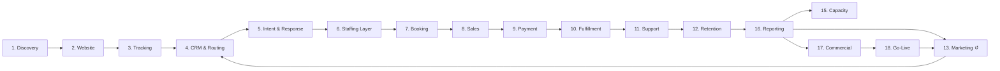

# Master Revenue + Customer Journey Ecosystem

End-to-end revenue operations — from first client contact through retention, attribution, and scale. Each numbered block below is a standalone Mermaid diagram extracted from a single source of truth ([`full-ecosystem.md`](full-ecosystem.md)).

> **Render:** GitHub renders ` ```mermaid ` blocks natively. No build step. Just open any file.

---

## Structure

```
mega-diag/
├── README.md               ← you are here (index)
├── full-ecosystem.md       ← single source of truth — complete 19-stage flowchart
└── processes/
    ├── 01-discovery-audit.md
    ├── 02-website-foundation.md
    ├── 03-tracking-attribution.md
    ├── 04-crm-routing-automation.md
    ├── 05-lead-intent-response.md
    ├── 06-staffing-layer.md
    ├── 07-calendar-appointment.md
    ├── 08-sales-conversion.md
    ├── 09-payment-transaction.md
    ├── 10-fulfillment-experience.md
    ├── 11-customer-support.md
    ├── 12-retention-winback.md
    ├── 13-marketing-traffic.md
    ├── 14-complaint-escalation.md
    ├── 15-staffing-capacity.md
    ├── 16-reporting-optimization.md
    ├── 17-commercial-structure.md
    ├── 18-go-live-checklist.md
    └── 19-live-ecosystem-loop.md
```

---

## Index — 19 Stages

| # | Stage | File | Focus |
|---|-------|------|-------|
| 1 | **Discovery & Current-State Audit** | [`processes/01-discovery-audit.md`](processes/01-discovery-audit.md) | 10 intake dimensions → 9 parallel audits → revenue-offer map + ownership check |
| 2 | **Website & Digital Foundation** | [`processes/02-website-foundation.md`](processes/02-website-foundation.md) | Live? Mobile? Speed? Trust? Offer pages → CTAs → LPs → A/B variants |
| 3 | **Tracking, Analytics & Attribution** | [`processes/03-tracking-attribution.md`](processes/03-tracking-attribution.md) | GA / GTM / Ads / Pixel+CAPI / Call+Form+Calendar / UTMs + verify loop |
| 4 | **CRM, Lead Routing & Automation** | [`processes/04-crm-routing-automation.md`](processes/04-crm-routing-automation.md) | Pipeline, 10 lead sources, routing rules, dedupe, consent, auto-journey |
| 5 | **Lead Intent & Response Handling** | [`processes/05-lead-intent-response.md`](processes/05-lead-intent-response.md) | Response? 4 follow-ups → 8-way intent (buy/info/book/support/cancel/complaint/spam/nurture) |
| 6 | **Customer Care / Sales Staffing Layer** | [`processes/06-staffing-layer.md`](processes/06-staffing-layer.md) | 5 agent types, SLA check, missed-contact escalation, internal escalation tree |
| 7 | **Calendar & Appointment Flow** | [`processes/07-calendar-appointment.md`](processes/07-calendar-appointment.md) | Availability → confirmation → reminders → show/no-show → reschedule |
| 8 | **Sales & Conversion** | [`processes/08-sales-conversion.md`](processes/08-sales-conversion.md) | Qualify → offer → purchase → objection handling (price/trust/payment/timing) |
| 9 | **Payment & Transaction Flow** | [`processes/09-payment-transaction.md`](processes/09-payment-transaction.md) | Success vs. decline/gateway/abandoned/fraud → retry, cart recovery, manual review |
| 10 | **Fulfillment & Customer Experience** | [`processes/10-fulfillment-experience.md`](processes/10-fulfillment-experience.md) | Delivery + 5 issue types (delay/incorrect/technical/customer/internal) |
| 11 | **Customer Support** | [`processes/11-customer-support.md`](processes/11-customer-support.md) | FAQ / account / urgent / billing / regulated / technical → resolution → supervisor |
| 12 | **Retention, Cancellation & Win-Back** | [`processes/12-retention-winback.md`](processes/12-retention-winback.md) | Post-purchase → satisfaction → recovery → upsell → churn save plays → win-back pool |
| 13 | **Marketing & Traffic Acquisition** | [`processes/13-marketing-traffic.md`](processes/13-marketing-traffic.md) | 7 channels → LP intent match → tracking → 6 CTA entries → retargeting |
| 14 | **Complaint & Escalation Management** | [`processes/14-complaint-escalation.md`](processes/14-complaint-escalation.md) | Low/Med/High (legal/medical) → email/supervisor/executive → documented resolution |
| 15 | **Staffing Capacity & Operations** | [`processes/15-staffing-capacity.md`](processes/15-staffing-capacity.md) | Volume/SLA/quality → hiring gate → recruit/prioritize → coaching/replace |
| 16 | **Reporting, Attribution & Optimization** | [`processes/16-reporting-optimization.md`](processes/16-reporting-optimization.md) | 12 KPIs → dashboard → attribution → performance model → 9-way leak diagnosis |
| 17 | **Commercial Structure** | [`processes/17-commercial-structure.md`](processes/17-commercial-structure.md) | Staff scope → margins → project costs → revenue-share terms → client approval |
| 18 | **Go-Live Checklist** | [`processes/18-go-live-checklist.md`](processes/18-go-live-checklist.md) | 7 gates (site, LPs, tracking, CRM, comms, staff, reporting) → Launch |
| 19 | **Live Ecosystem Loop** | [`processes/19-live-ecosystem-loop.md`](processes/19-live-ecosystem-loop.md) | Launch → marketing → 8 terminal events → reporting → weekly/monthly business review |
| ● | **Full Ecosystem (single file)** | [`full-ecosystem.md`](full-ecosystem.md) | Complete `flowchart TD` — 875 lines, all 19 blocks + cross-block edges |

---

## High-Level Flow (simplified)



> For the full detail, open [`full-ecosystem.md`](full-ecosystem.md) (rendered as a single large Mermaid diagram on GitHub).

---

## Editing

1. Edit the source of truth: [`full-ecosystem.md`](full-ecosystem.md)
2. Re-extract stage files — each `processes/##-*.md` `subgraph` block is a slice of the full file. Keep `flowchart TD` header + `subgraph … end` intact.
3. Verify on GitHub: push and confirm each file renders (diamonds `{ }` = decisions, rectangles = actions).

---

## Source

Mermaid `flowchart TD` — 19 subgraphs, 12 KPI nodes, 8 terminal → reporting edges, and a continuous business-review loop. Originally authored as a single `flowchart TD` definition; split here for navigability without losing the source of truth.

*License: private — © Mirch Media*
