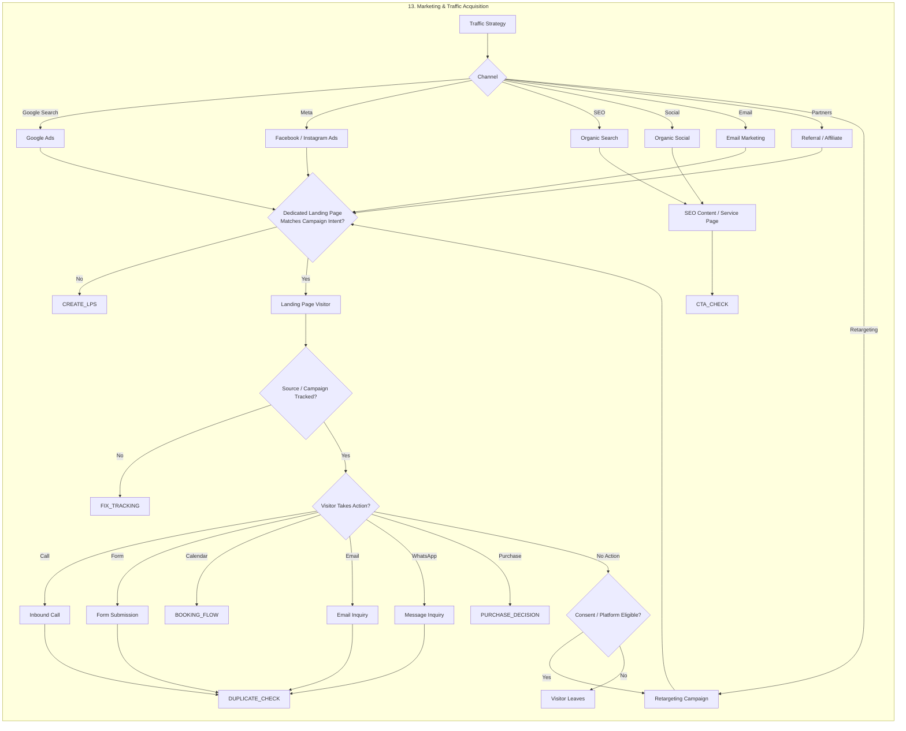

# 13. Marketing & Traffic Acquisition

> Traffic strategy across 7 channels, LP intent-match gate, source tracking and 6-way CTA entry into CRM.

## Purpose

Traffic strategy across 7 channels, LP intent-match gate, source tracking and 6-way CTA entry into CRM.

## Where it sits in the ecosystem

- **Upstream:** See [Full Ecosystem](../full-ecosystem.md) and [Index](../README.md)
- **Downstream:** Edges defined in the master diagram — this stage's exit points link to the next stage (e.g., Tracking → CRM → Intent).

## Key Gates / Decisions

_Decision diamonds ({ }) are gates that branch the flow. Rectangles are actions / states._

## Related

- [⬅ Index](../README.md)
- [Full Ecosystem Diagram](../full-ecosystem.md)

---
*Extracted from [`full-ecosystem.md`](../full-ecosystem.md) — source of truth. Edit the source and regenerate to update.*
